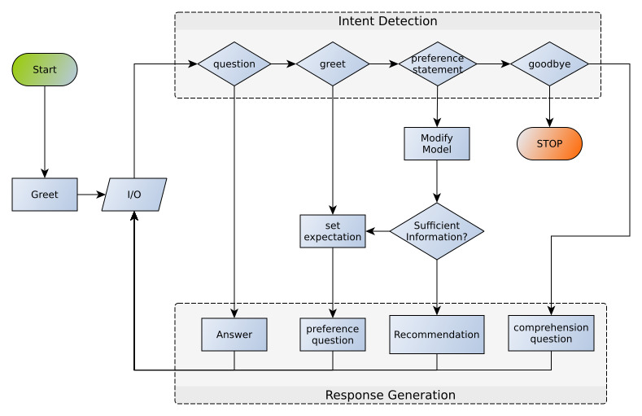

# find-subscription-price

## Install & Run
* git clone https://github.com/Mome/find-subscription-price
* pip install -r requirements.txt
* python chatbot_shell.py

## Short description
Every user message is assigned with an intent, like
'expressing a brand preference' or 'want more information'. Depending
on the intent and certain keywords in the message a model of the
user's preferences is modified. If every field in the preference model
is fed with information a recommendation is calculated.

# Flowchart

